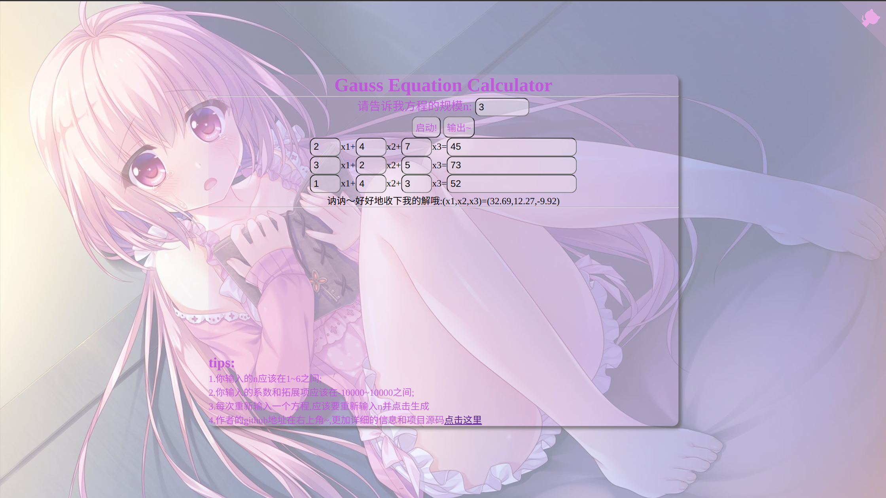
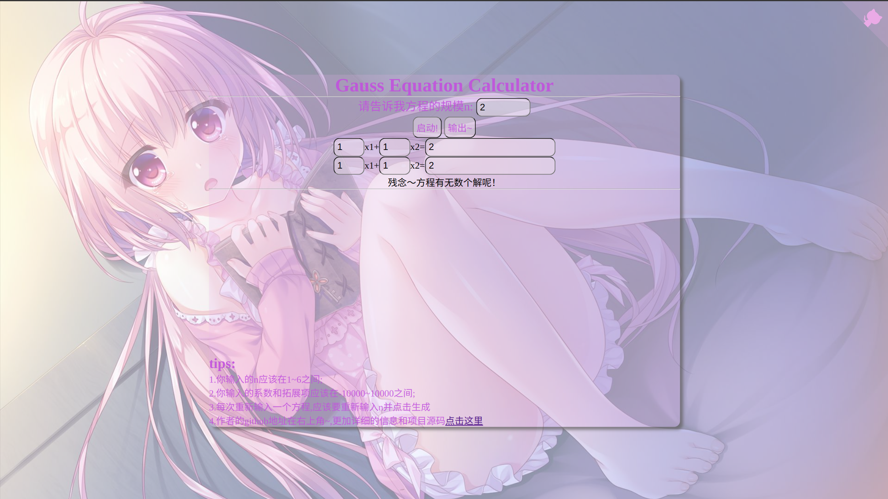
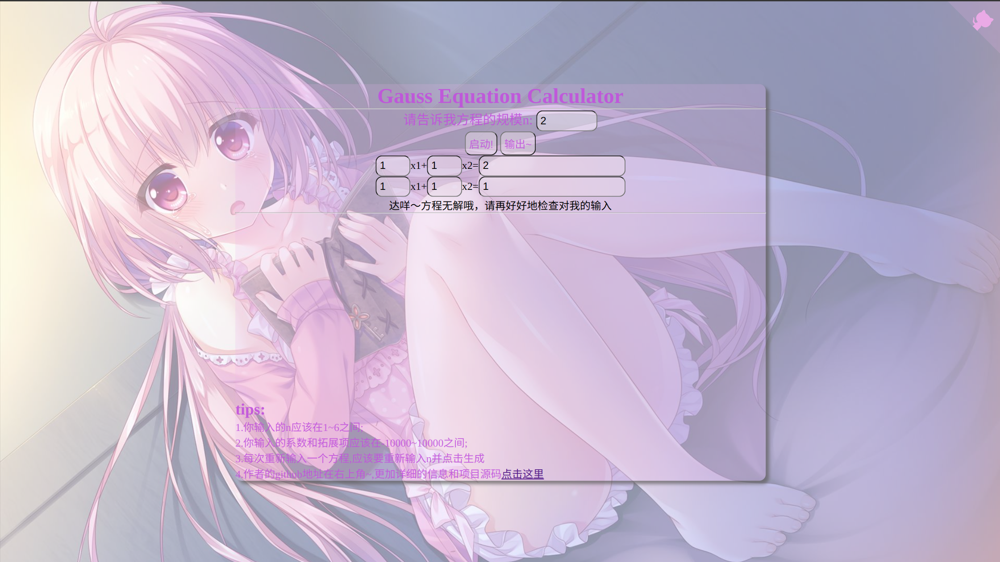

# A Web Equation Solver(UESTC-Go语言和区块链技术-期中设计)

## Introduction

This repository contains the source code for a **web-based equation solver**, capable of solving $n \times n(1 \leq n \leq 6)$ systems of equations and returning a tuple of length $n$ as the solution. If there are no solutions or infinite solutions, the web interface will throw the appropriate error message.

## Function

The frontend collects user input for the system of equations and generates a form, which is then sent to the backend in `JSON` format.

The backend parses the incoming `JSON`, uses the **Gauss elimination method** to solve the system of equations, and returns the result to the frontend as a string (covering cases with no solution or infinite solutions). The frontend displays the returned string.

There is no cross-origin resource sharing (CORS) configured between the frontend and backend, keeping the framework simple and straightforward.

## Usage

1. Clone the repository to your local machine: `git clone https://github.com/Kytolly/Equation.git`
2. Navigate to the `release` directory: `cd release`
   * If you're using `Linux`:
     * Execute the binary file: `./GaussCalculator_ubuntu20.04_version1.0`
     * Access via: `curl http://localhost:8080`
   * If you're using `Windows`:
     * Please turn off your firewall;
     * Double-click `run.bat` to run the program.

## Example

Here are some example images showing successful solution, infinite solutions, and no solution:

## License

This project is licensed under the MIT License, meaning you're free to use the source code however you like.

Warning: **Don’t cheat on your homework!** (just for uestcer).

## Remark

For more details about the project functionality, please refer to `Equation/report/report.md`. The project is completed, so it may not receive further maintenance. If you have any questions or encounter any terrifying bugs, feel free to submit an issue with details, or just email me at kytolly.xqy@gmail.com.

Hope this README makes your Golang trip nicer!

---

~~(时隔十个月来看以前的小白代码和玩具一样，但还是改下README)~~
